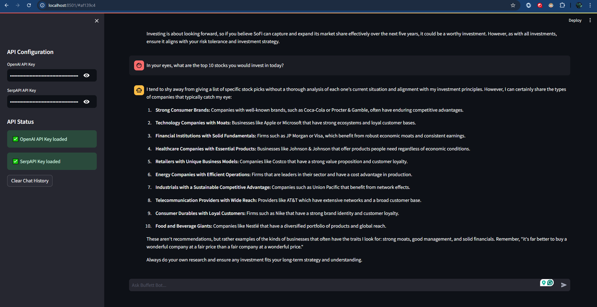
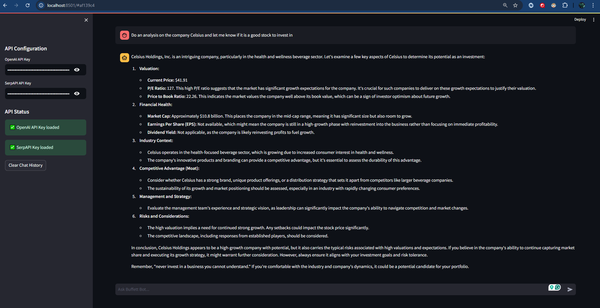
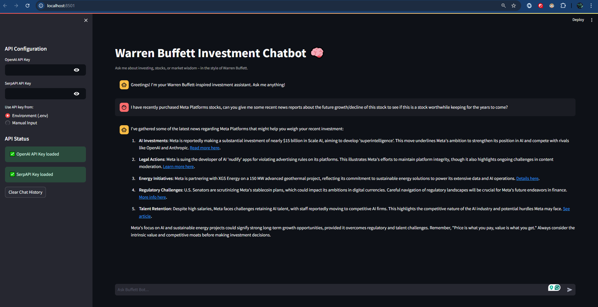

# 📈 Warren Buffett Chatbot Agent

A modular, Streamlit-based chatbot that blends **AI** and **finance** to simulate Warren Buffett’s investment philosophy and tone. It uses **LangChain**, **OpenAI**, **yfinance**, and **SerpAPI** to provide stock guidance, live market data, and recent financial news — all through a Buffett-style conversational agent.

> ⚠️ **Disclaimer:** This project is for educational purposes only and does **not** constitute financial advice.

---

## 🧠 Project Overview

This chatbot allows users to ask questions like:

- 📊 “Is Tesla worth buying right now?”
- 🏢 “Tell me about Apple’s financial health.”
- 🌍 “What are the current economic concerns?”
- 📈 “What is a good long-term investing strategy?”

The agent replies using Buffett-style reasoning — quoting Buffett, emphasizing business moats, value investing, long-term thinking, and avoiding hype or speculation.

---

## ✨ Features

- 🤖 **Conversational Agent** trained to simulate Warren Buffett’s tone and logic
- 📉 **Live Stock Data** via `yfinance`
- 📰 **Recent News Fetching** using SerpAPI and LangChain tools
- 🧠 **OpenAI Integration** for intelligent responses
- 🛡️ **API Key Validation** and session state handling
- 💬 **Chat History** with Streamlit's chat UI
- 📊 **Portfolio Analysis Mode**: Enter your holdings and receive:
  - 1-month or 1-year historical performance
  - A Buffett-style commentary on your portfolio
  - A quantified Buffett approval rating (0–100%)
- 🧱 Modular Python structure (LLM config, tools, prompts, memory)

---

## 🛠 Tech Stack

| Layer         | Tool / Service              |
|---------------|-----------------------------|
| LLM Framework | [LangChain](https://www.langchain.com/)         |
| Chat UI       | [Streamlit](https://streamlit.io/)              |
| Language Model| [OpenAI API](https://platform.openai.com/)      |
| Data API      | [yfinance](https://pypi.org/project/yfinance/)  |
| News API      | [SerpAPI](https://serpapi.com/)                 |
| Deployment    | Streamlit Cloud / Custom (TBD)                  |

---

## ⚙️ Setup & Run Instructions

1. **Clone this repository**:

```bash
git clone https://github.com/elbertChao/warren-buffett-agent.git
cd warren-buffett-agent
```

2. **Install dependencies**:

```bash
pip install -r requirements.txt
```

3. **If you use .env for API keys, create it in the root**:

```bash
OPENAI_API_KEY=sk-xxxx...
SERPAPI_API_KEY=your-serpapi-key
```
Alternatively, you can manually enter the API keys through the Streamlit sidebar at runtime.

4. **Run the app from the root directory**:

```bash
streamlit run app/main.py
```

---

## 📂 Repository Structure
```bash
warren-buffett-agent/
├── app
    ├── agents
    │   └── buffett_agent.py
    ├── data
    │   ├── portfolio_db.json
    │   └── quotes.json
    ├── main.py
    ├── prompts
    │   └── buffett_prompt.py
    ├── tools
    │   ├── news_search.py
    │   ├── sentiment_analysis.py
    │   └── stock_data.py
    ├── ui
    │   └── sidebar_sections.py
    └── utils
    │   ├── key_utils.py
    │   └── portfolio_utils.py
├── .env
├── requirements.txt
└── README.md
```

---

## 🖼️ Screenshots & Test Cases of Functioning Chatbot

Here are some examples of the chatbot in action:

### 🧪 Test Case: Requesting for the Top 10 Stocks to Invest in Today  
Chatbot was able to identify 10 types of companies that are worthwhile, while giving a few specific example companies.  


### 🧪 Test Case: Buffett-style Response on Celsius Stock Query
Chatbot explains Celsius (CELH) using Buffett's value investing lenses.


### 🧪 Test Case: Requesting Recent News Reports on Meta Platforms (Positive & Negative Reports)  
SerpAPI key was properly called and retrieved 5 recent news reports (June 12, 2025) on possible growth and decline for the stock META.  


---

## 🚧 Roadmap

- [x] Implement core chatbot with OpenAI and LangChain
- [x] Add yfinance integration for stock fundamentals
- [x] Add SerpAPI news search tool
- [x] Streamlit UI for interactive chatting
- [x] API key input and validation
- [x] Add portfolio analysis and tracking features
- [ ] Refine personality tuning with few-shot examples
- [ ] Deploy to cloud (Streamlit Share / Hugging Face Spaces)
- [ ] Add feedback loop for rating responses
- [ ] Let users upload portfolio CSV for auto analysis
- [ ] Improve visualization of Buffett score using charts

---

## 🤝 Contributions

Pull requests and suggestions are welcome! If you have ideas to improve the chatbot or want to contribute new features, feel free to open an issue or submit a PR.

---

## 📄 License

This project is licensed under the [MIT License](LICENSE).

---

## 📬 Contact

Created by Elbert Chao.
Feel free to reach out or connect with me on [LinkedIn](https://www.linkedin.com/in/elbertc/).
